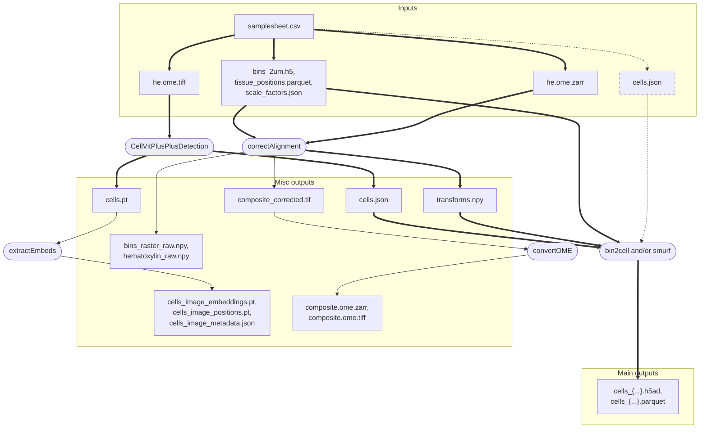

# ReSCope = **Re**gistration + **S**egmentation + **Co**nstruction of single-cell data + **pe**rformance

This repository contains the code for VisiumHD **H&E** data processing, implemented as NF workflow. 

The goal is to transform **bin x gene matrix** into **cell x gene matrix**. For now, two methods are implemented: **bin2cell** (Polański, K., Bartolomé-Casado, R., Sarropoulos, I., Xu, C., England, N., Jahnsen, F. L., Teichmann, S. A., & Yayon, N. (2024).  
*Bin2cell reconstructs cells from high resolution Visium HD data*. Bioinformatics. Oxford University Press. https://doi.org/10.1093/bioinformatics/btae546) and **smurf** (Guo, J., Sarafinovska, S., Hagenson, R., Valentine, M., Dougherty, J., Mitra, R. D., & Muegge, B. D. (2025). *SMURF Reconstructs Single-Cells from Visium HD Data to Reveal Zonation of Transcriptional Programs in the Intestine*. https://doi.org/10.1101/2025.05.28.656357). As the intermediate step, we also impelemeted image registration between transcript density signal and hematoxylin channel to correct for small misalignments eventually produced by spaceranger.

## Diagram of the pipeline



## Environment installation

Currently this pipeline works uses conda environment, the [environment.yml](./env/environment.yml) with all dependencies may be used for its creation, but we highly recomend to either reintsall pytorch suitable for your GPU via 
```bash
pip3 install torch torchvision --upgrade --force-reinstall
```
or to install everything from scratch
```bash
source ~/.bashrc
mamba create -n rescope3.10 python=3.10 openslide 
mamba activate rescope3.10
pip3 install torch torchvision
pip install cellvit "pysmurf[full]" dask geopandas simpleitk scipy==1.14.1
mamba install -c ome bioformats2raw raw2ometiff
```
## Launch example

```bash
nextflow run main.nf -c configs/params_and_resources.config -p main --input_csv YOUR_SAMPLESHEET.csv --outdir OUTPUTDIR
```

## Samplesheet structure
| Header | sample_id | cells_json | cells_pt | bins_adata | bins_parquet | scale_fac | he_zarr | custom_cells_json |
|--------|-----------|------------|----------|------------|--------------|-----------|---------|-------------------|
| Decription |used to name output folder|CellVit++ output|CellVit++ output|2um bin matrix generated by spaceranger|bins positions file|metadata with bin size|microscopy image in raw (OME-NGFF) format|custom segmentation (optional)|

## Testing with different options

```bash
# run full WF on example data, requires GB RAM and takes mins with 1 cpu and 1 Tesla V100-SXM2-32GB
nextflow run main.nf -with-report -c configs/params_and_resources.config -profile example -resume
```

```bash
# other scenarios
nextflow run main.nf -c configs/params_and_resources.config -profile example --extract_embeddings --correct_alignment false 
nextflow run main.nf -c configs/params_and_resources.config -profile example --segment_with_cvpp false --input_csv example/input/samplesheet_with_js_path.csv
```

# Future directions
- [ ] Add other options for segmentation (e.g. cellpose, InstanSeg), potentially to plugin lazyslide with facilitating automatic slide QC and processing
- [ ] Dynamical resource calculation based on input
- [ ] Docker image